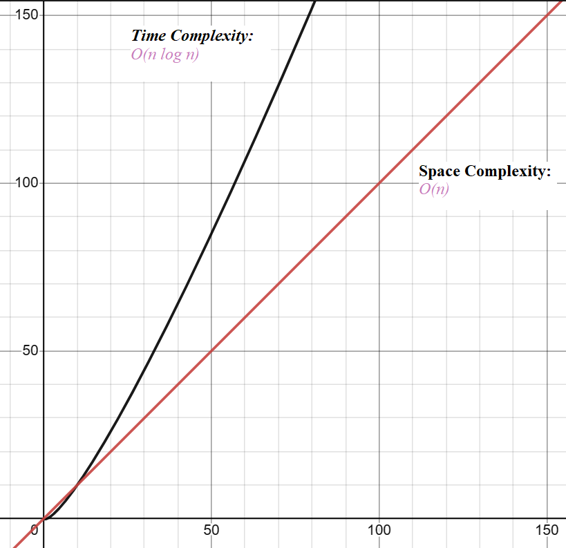
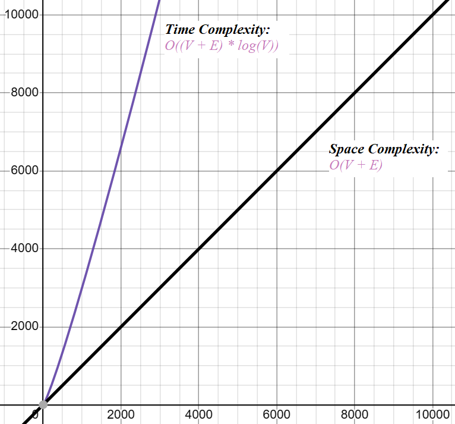
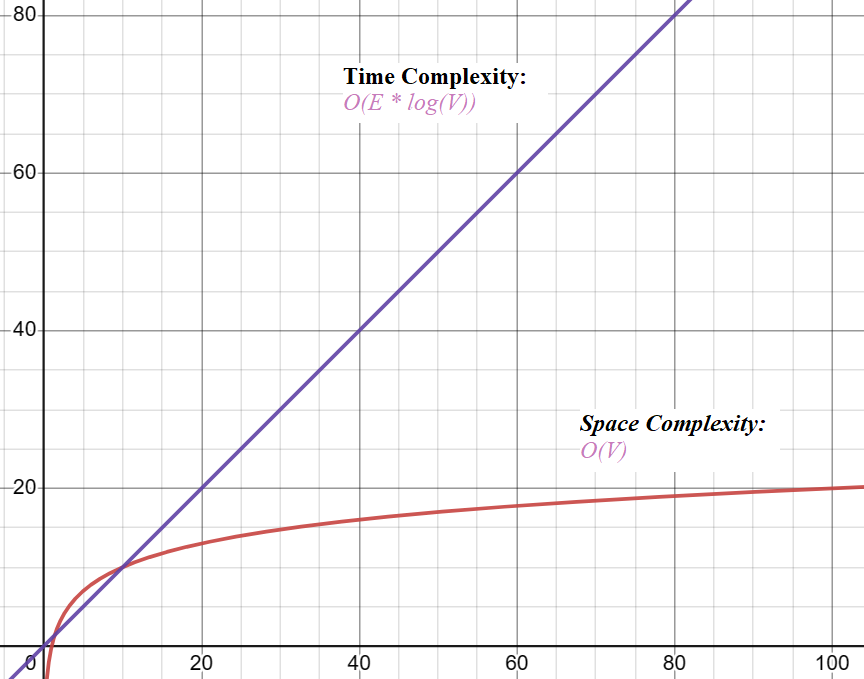

# DOCUMENTATION FOR COMPLEX DATA STRUCTURES
## Stoyan Hristozov 
Student number: 527573
--------------------------------------------------------------------------------------------------------------------------
# Table of Contents

## Data structures
1. [MyArrayList](#myarraylist)
    1. [Description](#description)
    2. [Constructors](#constructors)
    3. [Methods](#methods)
    4. [Space Complexity](#space-complexity)

2. [MyLinkedList](#mylinkedlist)
    1. [Description](#description-1)
    2. [Constructors](#constructors-1)
    3. [Methods](#methods-1)
    4. [Node Class](#node-class)
    5. [Additional Methods](#additional-methods)

3. [MyDoublyLinkedList](#mydoublylinkedlist)
    1. [Description](#description-2)
    2. [Constructors](#constructors-2)
    3. [Methods](#methods-2)
    4. [Node Class](#node-class-1)
    5. [Iterator Class](#iterator-class)

4. [MyGraph](#mygraph)
    1. [Description](#description-3)
    2. [Constructors](#constructors-3)
    3. [Methods](#methods-3)
    4. [Edge Class](#edge-class)
    5. [Internal Methods](#internal-methods)

5. [AVLTree](#avltree)
    1. [Description](#description-4)
    2. [Class: AVLTree<T extends Comparable<T>>](#class-avltreet-extends-comparablet)
        1. [Constructors](#constructors-4)
        2. [Methods](#methods-4)
    3. [Inner Class: Node](#inner-class-node)
        1. [Fields](#fields)
        2. [Constructor](#constructor)
    4. [Private Methods](#private-methods)

6. [MyHashMap](#myhashmap)
    1. [Description](#description-5)
    2. [Class: MyHashMap<K, V> implements CustomMap<K, V>](#class-myhashmapk-v-implements-custommapk-v)
        1. [Constructors](#constructors-5)
        2. [Methods](#methods-5)
    3. [Inner Class: MapNode<K, V>](#inner-class-mapnodek-v)
        1. [Fields](#fields-1)
        2. [Constructor](#constructor-1)
        3. [Methods](#methods-6)
    4. [Interface: CustomMap<K, V>](#interface-custommapk-v)
        1. [Methods](#methods-7)
        2. [Additional Methods](#additional-methods-1)

7. [BinarySearchTree](#binarysearchtree)
    1. [Description](#description-6)
    2. [Class: BinarySearchTree<T extends Comparable<T>>](#class-binarysearchtreet-extends-comparablet)
        1. [Fields](#fields-2)
        2. [Constructors](#constructors-6)
        3. [Methods](#methods-8)
    3. [Inner Interface: NodeAction<T> (Functional Interface)](#inner-interface-nodeactiont-functional-interface)
        1. [Methods](#methods-9)

8. [MinHeap](#minheap)
    1. [Description](#description-7)
    2. [Class: MinHeap<T extends Comparable<T>>](#class-minheapt-extends-comparablet)
        1. [Fields](#fields-3)
        2. [Constructors](#constructors-7)
        3. [Methods](#methods-10)
    3. [Additional Note](#additional-note)

## Algorithms

9. [MergeSort](#mergesort)
    1. [Description](#description-8)
    2. [Class: MergeSort<T extends Comparable<T>>](#class-mergesortt-extends-comparablet)
        1. [Constructors](#constructors-8)
        2. [Methods](#methods-11)
    3. [Time Complexity and Space Complexity](#time-complexity-and-space-complexity)

10. [Dijkstra Algorithm](#dijkstra-algorithm)
    1. [Description](#description-9)
    2. [Class: DijkstraAlgorithm<T>](#class-dijkstraalgorithmt)
        1. [Fields](#fields-4)
        2. [Constructors](#constructors-9)
        3. [Methods](#methods-12)
    3. [Time Complexity and Space Complexity](#time-complexity-and-space-complexity-1)
    4. [Efficiency](#efficiency)

11. [A* Algorithm](#a-algorithm)
    1. [Description](#description-10)
    2. [Class: AStarAlgorithm<T>](#class-astar-algorithmt)
        1. [Fields](#fields-5)
        2. [Nested Class: Node<K>](#nested-class-nodek)
        3. [Constructors](#constructors-10)
        4. [Methods](#methods-13)
    3. [Time Complexity and Space Complexity](#time-complexity-and-space-complexity-2)
    4. [Efficiency](#efficiency-1)

12. [Kruskal Algorithm](#kruskal-algorithm)
    1. [Description](#description-11)
    2. [Class: KruskalAlgorithm<T>](#class-kruskal-algorithmt)
        1. [Nested Class: Edge<U>](#nested-class-edgeu)
        2. [Constructors](#constructors-11)
        3. [Methods](#methods-14)
    3. [Time Complexity and Space Complexity](#time-complexity-and-space-complexity-3)
    4. [Efficiency](#efficiency-2)

13. [Linear Search (`SearchStationByNameLinear()`)](#linear-search-searchstationbynamelinear)
    1. [Time Complexity and Space Complexity](#time-complexity-and-space-complexity-4)

14. [Binary Search (`SearchStationByNameBinary()`)](#binary-search-searchstationbynamebinary)
    1. [Time Complexity and Space Complexity](#time-complexity-and-space-complexity-5)

## Additional Notes and Overall Summary:

15. [Overall Note](#overall-note)
    1. [Additional Note](#additional-note-1)

--------------------------------------------------------------------------------------------------------------------------

# DATA STRUCTURES:

--------------------------------------------------------------------------------------------------------------------------

# MyArrayList 

## Location: 
src/list/arrayLsit/MyArrayList.java

## Description:

`MyArrayList` is an implementation of the `list` interface that utilizes an internal `ArrayList`. It provides a dynamic array-like data structure where elements can be added, removed, and accessed efficiently.

## Constructors

### `public MyArrayList()`

- Initializes a new `MyArrayList` with an internal `ArrayList`.

## Methods

### `public void add(E element)`

- Adds the specified element to the end of the list.

### `public void add(int index, E element)`

- Inserts the specified element at the specified index in the list.
- **Time Complexity**: O(n) where n is the size of the list.

### `public void remove(E element)`

- Removes the first occurrence of the specified element from the list.
- **Time Complexity**: O(n) where n is the size of the list.

### `public void remove(int index)`

- Removes the element at the specified index from the list.
- **Time Complexity**: O(n) where n is the size of the list.

### `public E get(int index)`

- Retrieves the element at the specified index in the list.
- **Time Complexity**: O(1)

### `public boolean contains(E element)`

- Checks if the list contains the specified element.
- **Time Complexity**: O(n) where n is the size of the list.

### `public int size()`

- Returns the number of elements in the list.
- **Time Complexity**: O(1)

### `public boolean isEmpty()`

- Checks if the list is empty.
- **Time Complexity**: O(1)

### `public void clear()`

- Removes all elements from the list.
- **Time Complexity**: O(1)

### `public void set(int index, E element)`

- Sets the element at the specified index in the list.
- **Time Complexity**: O(1)

## Space Complexity

The space complexity of `MyArrayList` is primarily determined by the internal `ArrayList` implementation. The additional space required by `MyArrayList` itself is negligible compared to the space required by the elements stored in the list.

--------------------------------------------------------------------------------------------------------------------------

# MyLinkedList 

## Location:
src/list/linkedlist/MyLinkedList.java

## Description:

`MyLinkedList` is an implementation of the `list` interface and `Iterable` interface, providing a linked list data structure. It allows for dynamic insertion, deletion, and retrieval of elements.

## Constructors

### `public MyLinkedList()`

- Constructs an empty linked list.

## Methods

### `public void add(T element)`

- Adds the specified element to the end of the linked list.

### `public void add(int index, T element)`

- Inserts the specified element at the specified index in the linked list.
- **Time Complexity**: O(n) where n is the size of the list.

### `public void remove(T element)`

- Removes the first occurrence of the specified element from the linked list.

### `public void remove(int index)`

- Removes the element at the specified index from the linked list.
- **Time Complexity**: O(n) where n is the size of the list.

### `public T get(int index)`

- Retrieves the element at the specified index from the linked list.
- **Time Complexity**: O(n) where n is the size of the list.

### `public boolean contains(T element)`

- Checks if the linked list contains the specified element.
- **Time Complexity**: O(n) where n is the size of the list.

### `public int size()`

- Returns the number of elements in the linked list.
- **Time Complexity**: O(1)

### `public boolean isEmpty()`

- Checks if the linked list is empty.
- **Time Complexity**: O(1)

### `public void clear()`

- Clears the linked list.

### `public void set(int index, T element)`

- Sets the element at the specified index in the linked list.
- **Time Complexity**: O(n) where n is the size of the list.

### `public Iterator<T> iterator()`

- Returns an iterator over the elements in the linked list.

### `public MyLinkedList<T> reverse()`

- Reverses the linked list.
- **Time Complexity**: O(n) where n is the size of the list.

## Node Class

### `private static class Node<T>`

- Node class for the linked list.

## Additional Methods

### `public String toString()`

- Returns a string representation of the linked list.

-----------------------------------------------------------------------------------------------------------

# MyDoublyLinkedList 

## Location:
src/list/doublelinkedlist/MyDoublyLinkedList.java

## Description:

`MyDoublyLinkedList` is an implementation of the `list` interface and `Iterable` interface, providing a doubly linked list data structure. It allows for dynamic insertion, deletion, and retrieval of elements with bidirectional traversal capabilities.

## Constructors

### `public MyDoublyLinkedList()`

- Constructs an empty doubly linked list.

## Methods

### `public void add(E element)`

- Adds the specified element to the end of the doubly linked list.

### `public void add(int index, E element)`

- Inserts the specified element at the specified index in the doubly linked list.

### `public void remove(E element)`

- Removes the first occurrence of the specified element from the doubly linked list.

### `public void remove(int index)`

- Removes the element at the specified index from the doubly linked list.

### `public E get(int index)`

- Retrieves the element at the specified index from the doubly linked list.

### `public boolean contains(E element)`

- Checks if the doubly linked list contains the specified element.

### `public int size()`

- Returns the number of elements in the doubly linked list.

### `public boolean isEmpty()`

- Checks if the doubly linked list is empty.

### `public void clear()`

- Clears all elements from the doubly linked list.

### `public void set(int index, E temp)`

- Sets the element at a specific index in the doubly linked list.

### `public Iterator<E> iterator()`

- Provides an iterator for the doubly linked list.

### `public void swap(int index1, int index2)`

- Swaps the elements at the specified indices in the doubly linked list.

## Node Class

### `public class Node<E>`

- Node class for the doubly linked list.

## Iterator Class

### `private class LinkedListIterator implements Iterator<E>`

- Iterator implementation for the doubly linked list.

---------------------------------------------------------------------------------------------------------
# MyGraph

## Location:
src/graph/MyGraph.java

## Description:

`MyGraph` is a graph implementation that conforms to the `Graph` interface. It provides functionality for creating and manipulating graphs with vertices and edges. The graph can be directed, undirected, weighted, or unweighted.

## Constructors

### `public MyGraph()`

- Constructs a new `MyGraph` with default properties.

### `public MyGraph(boolean isDirected, boolean isWeighted)`

- Constructs a new `MyGraph` with specified properties.

## Methods

### `public boolean areConnected(T value1, T value2)`

- Checks if two vertices are connected in the graph.

### `public boolean contains(T value)`

- Checks if the graph contains a given vertex.

### `public int getVertexCount()`

- Gets the count of vertices in the graph.

### `public boolean isEmpty()`

- Checks if the graph is empty.

### `public void addVertex(T value)`

- Adds a vertex to the graph.

### `public void connect(T value1, T value2)`

- Connects two vertices in the graph.

### `public void connect(T value1, T value2, double weight)`

- Connects two vertices in the graph with a specified weight.

### `public double getWeight(T value1, T value2)`

- Gets the weight of the connection between two vertices.

### `public Iterable<T> getNeighbours(T value)`

- Gets the neighbors of a vertex in the graph.

### `public boolean isDirected()`

- Checks if the graph is directed.

### `public boolean isWeighted()`

- Checks if the graph is weighted.

### `public Collection<T> getVertices()`

- Gets a collection of all vertices in the graph.

### `public void addConnection(Connection connection)`

- Adds a connection to the graph using a `Connection` object.

### `public void printGraph()`

- Prints the adjacency list representation of the graph.

### `public boolean containsVertex(Object vertex)`

- Checks if a vertex contains any neighbors in the graph.

### `public MyLinkedList<GraphWeight.Node<T>> getConnection(T current)`

- Gets the connections of a vertex in the graph.

### `public void addEdge(T a, T b, double weight)`

- Adds a weighted edge to the graph.

### `public double getHeuristicCostToDestination(T start, T goal, Function<T, Double> heuristicFunction)`

- Computes the heuristic cost from the start to the goal using a specified heuristic function.

### `public Double getCostBetweenNodes(T current, T neighbor)`

- Gets the cost of the connection between two nodes.

### `public list<T> BFS(T startVertex)`

- Performs a breadth-first search starting from a given vertex.

### `public Stack<T> DFS(T startVertex)`

- Performs a depth-first search starting from a given vertex.

### `public list<Station> findStationsInRectangle(double startLatitude, double startLongitude, double endLatitude, double endLongitude)`

- Performs a breadth-first search to find stations within a rectangle defined by GPS coordinates.

## Edge Class

### `class Edge<T>`

- Represents an edge between two vertices.

## Internal Methods

- Internal methods such as `addVertexIfNotExist`, `bfsForRectangle`, and `isStationInRectangle` are used for specific functionalities and are not intended for external use.

---------------------------------------------------------------------------------------------------------
# AVLTree

## Location:
src/AVLTree/AVLTree.java

## Description:

`AVLTree` is an implementation of a self-balancing binary search tree known as an AVL tree. It ensures that the tree remains balanced after insertions and deletions, maintaining a logarithmic height.

## Class: AVLTree<T extends Comparable<T>>

### Constructors

- `public AVLTree()`
    - Constructs a new AVL tree.

### Methods

#### `public void insert(T key)`

- Inserts a key into the AVL tree while maintaining balance.

#### `public void remove(T key)`

- Removes a key from the AVL tree while maintaining balance.

#### `public List<T> inOrderTraversal()`

- Performs an in-order traversal of the AVL tree, returning a list of keys.

#### `public boolean isBalanced()`

- Checks if the AVL tree is balanced.

#### `public Node getRoot()`

- Gets the root node of the AVL tree.

#### `public boolean isEmpty()`

- Checks if the AVL tree is empty.

#### `public int size()`

- Gets the size (number of nodes) of the AVL tree.

#### `public boolean contains(T key)`

- Checks if a key exists in the AVL tree.

#### `public T get(T key)`

- Retrieves the value associated with a key.

#### `public String graphViz()`

- Generates the Graphviz representation of the AVL tree.

### Inner Class: Node

- `private class Node`
    - Represents a node in the AVL tree.

  #### Fields

    - `T key`: The key of the node.
    - `int height`: The height of the node.
    - `Node left`: Reference to the left child of the node.
    - `Node right`: Reference to the right child of the node.

  #### Constructor

    - `Node(T value)`: Constructs a new node with the specified key.

### Private Methods

#### `private Node insert(Node node, T key)`

- Inserts a key into the AVL tree (helper method).

#### `private Node remove(Node node, T key)`

- Removes a key from the AVL tree (helper method).

#### `private void inOrderTraversal(Node node, List<T> result)`

- Performs an in-order traversal of the AVL tree (helper method).

#### `private boolean isBalanced(Node node)`

- Checks if the AVL tree is balanced (helper method).

#### `private Node findMin(Node node)`

- Finds the node with the minimum key value in the AVL tree (helper method).

#### `private int height(Node node)`

- Gets the height of a node.

#### `private void updateHeight(Node node)`

- Updates the height of a node.

#### `private int getBalance(Node node)`

- Gets the balance factor of a node.

#### `private Node rotateRight(Node y)`

- Performs a right rotation around the given node.

#### `private Node rotateLeft(Node x)`

- Performs a left rotation around the given node.

## Additional Note:

- The AVL tree ensures logarithmic height, providing efficient operations.
- Time complexities: Insertion and removal - O(log N), Traversal - O(N).

---------------------------------------------------------------------------------------------------------

# MyHashMap 

## Location:
src/map/MyHashMap.java

## Description:

`MyHashMap` is a custom implementation of a hash map. It uses an array of linked lists to handle collisions and allows for efficient key-value mappings.

## Class: MyHashMap<K, V> implements CustomMap<K, V>

### Constructors

- `public MyHashMap()`

    - Constructs a new `MyHashMap` with the default capacity.

- `public MyHashMap(int initialCapacity)`

    - Constructs a new `MyHashMap` with the specified initial capacity.

### Methods

#### `public void put(K key, V value)`

- Associates the specified value with the specified key in this map.

#### `public V get(K key)`

- Returns the value to which the specified key is mapped.

#### `public boolean containsKey(K key)`

- Returns true if this map contains a mapping for the specified key.

#### `public boolean containsValue(V value)`

- Returns true if this map maps one or more keys to the specified value.

#### `public void remove(K key)`

- Removes the mapping for the specified key from this map if present.

#### `public int size()`

- Returns the number of key-value mappings in this map.

#### `public boolean isEmpty()`

- Returns true if this map contains no key-value mappings.

#### `public void clear()`

- Removes all of the mappings from this map.

#### `public Iterable<K> keySet()`

- Returns an iterable containing all the keys in this map.

#### `public boolean contains(K key)`

- Returns true if this map contains the specified key.

#### `public V getOrDefault(K key, V defaultValue)`

- Returns the value to which the specified key is mapped, or a default value if this map contains no mapping for the key.

#### `public MyLinkedList<V> searchBySubstring(K searchSubstring)`

- Searches for values in the hashmap whose key contains the specified substring. Returns a linked list containing values whose key contains the specified substring.

### Private Methods

#### `private int getBucketIndex(K key)`

- Calculates the bucket index for a given key based on its hash code.

#### `private void resize()`

- Resizes the hashmap when the load factor exceeds the threshold. Rehashes all existing entries to new buckets.

## Inner Class: MapNode<K, V>

- `MapNode` is a node class for a generic map, representing a key-value pair.

### Fields

- `private K key`: The key of the key-value pair.
- `private V value`: The value of the key-value pair.
- `private MapNode<K, V> next`: Reference to the next `MapNode` in the linked list.

### Constructor

- `public MapNode(K key, V value)`: Constructs a `MapNode` with the specified key and value.

### Methods

- `public K getKey()`: Gets the key of the key-value pair.
- `public V getValue()`: Gets the value of the key-value pair.
- `public MapNode<K, V> getNext()`: Gets the next `MapNode` in the linked list.
- `public void setNext(MapNode<K, V> next)`: Sets the next `MapNode` in the linked list.
- `public void setValue(V value)`: Sets the value of the key-value pair.

## Interface: CustomMap<K, V>

- `CustomMap` interface represents a simple key-value mapping.

### Methods

- `void put(K key, V value)`: Associates the specified value with the specified key in this map.
- `V get(K key)`: Returns the value to which the specified key is mapped.
- `boolean containsKey(K key)`: Returns true if this map contains a mapping for the specified key.
- `boolean containsValue(V value)`: Returns true if this map maps one or more keys to the specified value.
- `void remove(K key)`: Removes the mapping for the specified key from this map if present.
- `int size()`: Returns the number of key-value mappings in this map.
- `boolean isEmpty()`: Returns true if this map contains no key-value mappings.
- `void clear()`: Removes all of the mappings from this map.
- `Iterable<K> keySet()`: Returns an iterable containing all the keys in this map.
- `boolean contains(K key)`: Returns true if this map contains the specified key.
- `V getOrDefault(K key, V defaultValue)`: Returns the value to which the specified key is mapped, or a default value if this map contains no mapping for the key.

--------------------------------------------------------------------------------------------------------------------------------------------------------------------------

# BinarySearchTree

## Location:
src/tree/binarytree/BinarySearchTree.java

## Description:

`BinarySearchTree` is a generic implementation of a binary search tree (BST). It allows the insertion, search, and deletion of elements in a way that preserves the order of elements.

## Class: BinarySearchTree<T extends Comparable<T>>

### Fields

- `private Node<T> root`: The root of the binary search tree.

### Constructors

- `public BinarySearchTree()`

    - Constructs a new empty `BinarySearchTree`.

### Methods

#### `public boolean isEmpty()`

- Checks if the BST is empty.

#### `public int size()`

- Gets the number of elements in the BST.

#### `public int height()`

- Gets the height of the BST.

#### `public String toString()`

- Gets a string representation of the BST.

#### `public void insert(T value)`

- Inserts a value into the BST.

#### `private Node<T> insertRec(Node<T> root, T value)`

- Recursive helper method for inserting a value into the BST.

#### `public boolean search(T value)`

- Searches for a value in the BST.

#### `private boolean searchRec(Node<T> root, T value)`

- Recursive helper method for searching a value in the BST.

#### `public void inOrderTraversal()`

- Performs an in-order traversal of the BST.

#### `public void inOrderTraversalRecursive(NodeAction<T> action)`

- Performs an in-order traversal of the BST with a custom action for each node.

#### `private void inOrderTraversalRecursive(Node<T> root, NodeAction<T> action)`

- Recursive helper method for in-order traversal with a custom action.

#### `public void delete(T value)`

- Deletes a value from the BST.

#### `private Node<T> deleteRec(Node<T> root, T value)`

- Recursive helper method for deleting a value from the BST.

#### `private T minValue(Node<T> root)`

- Finds the value of the node with the minimum value in the given subtree.

#### `public MyLinkedList<Station> searchBySubstring(String searchSubstring)`

- Searches for values in the BST whose key (Station name) contains the specified substring.

#### `private void searchBySubstringRecursive(Node<T> root, String searchSubstring, MyLinkedList<Station> result)`

- Recursive helper method for searching values by substring.

### Inner Interface: NodeAction<T> (Functional Interface)

- `NodeAction` is a functional interface representing the action to be performed on each node during traversal.

#### Methods

- `void perform(T data)`: Performs an action on the given data.

### Inner Class: Node<T>

- `Node` is a private static class representing a node in the binary search tree.

#### Fields

- `T data`: The data of the node.
- `Node<T> left, right`: References to the left and right child nodes.

#### Constructor

- `Node(T value)`: Constructs a new node with the given value.

---------------------------------------------------------------------------------------------------------------------------

# MinHeap 

## Location:
src/tree/minheap/MinHeap.java

## Description:

`MinHeap` is a generic implementation of a min-heap. It stores elements of type T, maintaining the heap property where the parent is smaller than or equal to its children.

## Class: MinHeap<T extends Comparable<T>>

### Fields

- `private final int DEFAULT_CAPACITY = 10`: The default initial capacity of the heap.
- `private Object[] arr`: The array used to store elements in the heap.
- `private int size`: The current number of elements in the heap.
- `private final Comparator<T> comparator`: The comparator to determine the order of elements.

### Constructors

- `public MinHeap(Comparator<T> comparator)`

    - Constructs a new `MinHeap` with the specified comparator.

- `public MinHeap()`

    - Constructs a new `MinHeap` using natural ordering.

### Methods

#### `public void insert(T element)`

- Inserts an element into the heap.

#### `public void push(T element)`

- Pushes an element onto the heap.

#### `public T pop()`

- Removes and returns the minimum element from the heap.

#### `public T peek()`

- Returns the minimum element in the heap without removing it.

#### `public boolean isEmpty()`

- Checks if the heap is empty.

#### `public int size()`

- Returns the number of elements in the heap.

#### `private void heapifyUp()`

- Performs the heapify-up operation to maintain the heap property.

#### `private void heapifyDown()`

- Performs the heapify-down operation to maintain the heap property.

#### `private void swap(int index1, int index2)`

- Swaps elements at the given indices in the array.

#### `private boolean hasParent(int index)`

- Checks if an element has a parent in the heap.

#### `private int getParentIndex(int index)`

- Returns the index of the parent of an element.

#### `private T getParent(int index)`

- Returns the parent of an element.

#### `private boolean hasLeftChild(int index)`

- Checks if an element has a left child in the heap.

#### `private int getLeftChildIndex(int index)`

- Returns the index of the left child of an element.

#### `private T getLeftChild(int index)`

- Returns the left child of an element.

#### `private boolean hasRightChild(int index)`

- Checks if an element has a right child in the heap.

#### `private int getRightChildIndex(int index)`

- Returns the index of the right child of an element.

#### `private T getRightChild(int index)`

- Returns the right child of an element.

#### `private T getElement(int index)`

- Returns the element at the specified index in the array.

#### `private int compare(T obj1, T obj2)`

- Compares two elements using the provided comparator or natural ordering.

#### `private void resizeArray()`

- Resizes the internal array to accommodate more elements.

### Note

- The class utilizes a generic array to store elements, which may raise unchecked cast warnings. This is handled with the `@SuppressWarnings("unchecked")` annotation where necessary.

---------------------------------------------------------------------------------------------------------------------------
# ALGORITHMS
All graphs have been created by me using Desmos. I've converted  the big O complexity into mathematical functions since I did not know where to make the graphs. Those will be all specified for further clarity

I will justify this approach by saying that instead of making a graph with at least 5 data points, using a mathematical function to represent the complexities in the first quadrant of a coordinate system will give us a technically infinite amount of datapoints the further we go away from the (0 ; 0) coordinate (going right from the bottomleft corner).

Since the coordinates have been provided I will defend this choice if I have to.

---------------------------------------------------------------------------------------------------------------------------
# SelectionSort

## Location:
`src/sorting/selectionsort/SelectionSort.java`

## Description:

`SelectionSort` is a generic implementation of the selection sort algorithm. It is an in-place comparison sorting algorithm that divides the input into a sorted and an unsorted region. The algorithm repeatedly selects the smallest (or largest) element from the unsorted region and swaps it with the first unsorted element.

## Class: `SelectionSort<T extends Comparable<T>>`

### Constructors

- `public SelectionSort()`

    - Constructs a new instance of `SelectionSort`.

### Methods

#### `public T[] sort(T[] array)`

- Sorts the input array using the selection sort algorithm.

    - **Parameters:**
        - `array`: The array to be sorted.

    - **Returns:**
        - A sorted array.

### Time Complexity: O(n^2)

- The time complexity of the selection sort algorithm is O(n^2), where n is the number of elements in the array.

### Space Complexity: O(1)

- The space complexity of the selection sort algorithm is O(1) as it sorts the elements in-place.

## Visualisation:

Functions:

Time complexity: f(n) = n^2

Space Complexity: g(n) = 1

### Efficiency:

- Selection sort is efficient for small datasets and is easy to implement. However, it has a higher time complexity compared to more advanced algorithms and is less suitable for large datasets.
---------------------------------------------------------------------------------------------------------------------------

# MergeSort 

## Location:
src/sorting/mergesort/MergeSort.java

## Description:

`MergeSort` is a generic implementation of the merge sort algorithm. It is a divide-and-conquer sorting algorithm that divides the input array into two halves, recursively sorts each half, and then merges the sorted halves.

## Class: MergeSort<T extends Comparable<T>>

### Constructors

- `public MergeSort()`

    - Constructs a new instance of `MergeSort`.

### Methods

#### `public T[] sort(T[] array)`

- Sorts the input array using the merge sort algorithm.

    - **Parameters:**
        - `array`: The array to be sorted.

    - **Returns:**
        - A sorted array.

#### `private void merge(T[] array, T[] left, T[] right)`

- Merges two sorted arrays into a single sorted array.

    - **Parameters:**
        - `array`: The array to merge into.
        - `left`: The left sorted array.
        - `right`: The right sorted array.

### Time Complexity: O(n log n)

- The time complexity of the merge sort algorithm is O(n log n), where n is the number of elements in the array.

### Space Complexity: O(n)

- The space complexity of the merge sort algorithm is O(n) due to the additional space required for merging two halves.

## Visualisation:

Functions:

Time complexity: f(n) = n * log(n)

Space Complexity: g(n) = n

### Efficiency:

- Merge sort is efficient for large datasets and provides stable sorting. It is particularly useful for linked lists and external sorting scenarios. However, it may have a higher space requirement compared to in-place sorting algorithms.

---------------------------------------------------------------------------------------------------------------------------
# Dijkstra Algorithm

## Location:
src/traversal/dijkstra/DijkstraAlgorithm.java

## Description:

`DijkstraAlgorithm<T>` is a class that provides a method to find the shortest path in a weighted graph using Dijkstra's algorithm. Dijkstra's algorithm is a popular algorithm for finding the shortest path between nodes in a graph with non-negative edge weights.

## Class: DijkstraAlgorithm<T>

### Fields

- `private MyHashMap<T, Double> distances`

    - A map to store the distances from the source vertex to each vertex in the graph.

### Constructors

- `public DijkstraAlgorithm()`

    - Constructs a new instance of `DijkstraAlgorithm`.

### Methods

#### `public MyLinkedList<T> findShortestPath(MyGraph<T> graph, T source, T destination)`

- Finds the shortest path in a weighted graph using Dijkstra's algorithm.

    - **Parameters:**
        - `graph`: The weighted graph.
        - `source`: The source vertex.
        - `destination`: The destination vertex.

    - **Returns:**
        - A linked list representing the shortest path from the source to the destination.

#### `private void relaxNeighbours(MyGraph<T> graph, T current, MyHashMap<T, Double> distances, MyHashMap<T, T> previousVertices, PriorityQueue<Node<T>> priorityQueue, Set<T> settled)`

- Relaxes the distances of neighboring vertices during Dijkstra's algorithm.

#### `private MyLinkedList<T> constructPath(T source, T destination, MyHashMap<T, T> previousVertices)`

- Constructs the shortest path from the source to the destination.

#### `public MyHashMap<T, Double> getDistances()`

- Returns the map of distances from the source to each vertex.

#### `public String getDistancesToString()`

- Returns a string representation of distances from the source to each vertex.

## COMPLEXITY
- The space and time complexities are specifically for the classes in the current program.

## Time Complexity: O((V + E) * log(V))

Priority Queue Operations:

- The time complexity is dominated by the operations on the priority queue, particularly the poll and add operations.
- Each vertex is added and removed from the priority queue at most once, resulting in a total time complexity proportional to the number of vertices.

Relaxation of Neighbors:
- The relaxation step, which involves updating distances and adding vertices to the priority queue, is executed for each edge at most once.
- Therefore, the time complexity related to the relaxation step is proportional to the number of edges.

### The overall time complexity is O((V + E) * log(V)), where V is the number of vertices and E is the number of edges.

## Space Complexity: O(V + E)

Vertices and Edges:

- The space complexity is mainly influenced by the data structures used to store distances, previous vertices, settled vertices, and the priority queue.
- The distances map stores distances from the source to each vertex, resulting in space proportional to the number of vertices.
- The previousVertices map maintains the previous vertex in the shortest path, contributing to space proportional to the number of vertices.
- The settled set keeps track of vertices that have been settled, contributing to space proportional to the number of vertices.
- The priorityQueue uses extra space proportional to the number of vertices.

### Therefore, the overall space complexity is O(V + E), where V is the number of vertices and E is the number of edges.

## Visualisation:

Functions:
Time complexity: f(V) = V * log(V)

Space Complexity: g(V) = V

## Efficiency and Justification:

The Dijkstra algorithm is known for its efficiency in finding the shortest path in a weighted graph, when all edge weights are non-negative.
The use of a priority queue ensures that the algorithm prioritizes vertices with the shortest known distance, optimizing the search process.
The implementation avoids unnecessary relaxations by checking for settled vertices and negative edge weights.

---------------------------------------------------------------------------------------------------------------------------
# A* Algorithm

## Location:
src/traversal/astar/AStarAlgorithm.java

## Description:

`AStarAlgorithm<T>` is a class that provides a method to find the shortest path in a weighted graph using the A* algorithm. A* is a popular pathfinding and graph traversal algorithm that combines the benefits of Dijkstra's algorithm and a heuristic to efficiently find the shortest path in a graph.

## Class: AStarAlgorithm<T>

### Fields

- `private MyHashMap<T, Double> gScores`

    - A map to store the cost from the start to each node.

- `private MyHashMap<T, Double> fScores`

    - A map to store the combined cost (gScore + heuristic cost) to each node.

### Nested Class: Node<K>

- A static nested class representing a node in the A* algorithm with a vertex, gScore, and fScore.

    - **Constructor:**
        - `public Node(K vertex, double gScore, double fScore)`

### Constructors

- `public AStarAlgorithm(MyGraph<T> graph)`

    - Constructs a new instance of `AStarAlgorithm` with the specified graph.

### Methods

#### `public list<T> findShortestPath(T start, T goal)`

- Finds the shortest path in a weighted graph using the A* algorithm.

    - **Parameters:**
        - `start`: The start vertex.
        - `goal`: The goal vertex.

    - **Returns:**
        - A list representing the shortest path from the start to the goal.

#### `private list<T> reconstructPath(MyHashMap<T, T> cameFrom, T current)`

- Reconstructs the path from the `cameFrom` map.

#### `private double getHeuristicCostToDestination(T start, T goal)`

- Calculates the heuristic cost (estimated cost) from the start to the goal using the Haversine formula.

## COMPLEXITY
- The space and time complexities are specifically for the classes in the current program.

## Time Complexity: O((V + E) * log(V))

**Priority Queue Operations:**
- The time complexity is dominated by the operations on the priority queue, particularly the poll and add operations.
- Each vertex is added and removed from the priority queue at most once, resulting in a total time complexity proportional to the number of vertices.

**Relaxation of Neighbors:**
- The relaxation step, which involves updating scores and adding vertices to the priority queue, is executed for each edge at most once.
- Therefore, the time complexity related to the relaxation step is proportional to the number of edges.

### The overall time complexity is O((V + E) * log(V)), where V is the number of vertices and E is the number of edges.

## Space Complexity: O(V + E)

**Vertices and Edges:**
- The space complexity is mainly influenced by the data structures used to store gScores, fScores, the priority queue, and the 'cameFrom' map.
- The gScores map stores the cost from the start to each vertex, resulting in space proportional to the number of vertices.
- The fScores map maintains the combined cost (gScore + heuristic cost) to each vertex, contributing to space proportional to the number of vertices.
- The 'cameFrom' map keeps track of the previous vertices, contributing to space proportional to the number of vertices.
- The priority queue uses extra space proportional to the number of vertices.

### Therefore, the overall space complexity is O(V + E), where V is the number of vertices and E is the number of edges.

## Visualisation:

Functions:
Time complexity: h(V) = V * log(V)

Space Complexity: i(V) = V

## Efficiency and Justification:

The A* algorithm is known for its efficiency in finding the shortest path in a weighted graph by incorporating a heuristic (estimated cost) to guide the search efficiently. The priority queue ensures that the algorithm prioritizes vertices with the lowest estimated cost, optimizing the search process.

The implementation avoids unnecessary exploration of paths by considering the estimated total cost and updating the path only when a lower-cost path is found. The heuristic function, based on the Haversine formula, is used to estimate the cost from the current vertex to the goal.

The algorithm is efficient for graphs with non-negative weights and provides a balance between completeness and optimality. The heuristic helps guide the search towards the goal while the cost function ensures that the path taken is the most efficient.

It is VERY VERY IMPORTANT to note that when A* algorithm is used without a well-informed heuristic (i.e., when the heuristic is effectively zero or does not provide any useful information), it essentially behaves like Dijkstra's algorithm. In such cases, A* degenerates to the behavior of Dijkstra's algorithm because the heuristic term becomes irrelevant, and the algorithm relies solely on the actual cost from the start to the current node.

The strength of A* lies in its ability to efficiently explore the search space by prioritizing nodes that are expected to lead to the goal more quickly, thanks to the heuristic function. Without a meaningful heuristic, A* loses this advantage, and its performance converges towards that of Dijkstra's algorithm, which explores nodes in a uniform-cost manner without considering any estimated costs.

---------------------------------------------------------------------------------------------------------------------------

# Kruskal Algorithm 

## Location:
src/traversal/kruskal/KruskalAlgorithm.java

## Description:

`KruskalAlgorithm<T>` is a class that provides a method to find the minimum spanning tree of a connected, undirected graph using Kruskal's algorithm. Kruskal's algorithm is a greedy algorithm that finds a minimum spanning tree for a connected weighted graph.

## Class: KruskalAlgorithm<T>

### Nested Class: Edge<U>

- A public static nested class representing an edge in the graph with a source vertex, destination vertex, and weight.

    - **Constructor:**
        - `public Edge(U source, U destination, double weight)`

    - **Methods:**
        - `public U getSource()`: Returns the source vertex of the edge.
        - `public U getDestination()`: Returns the destination vertex of the edge.
        - `public double getWeight()`: Returns the weight of the edge.
        - `@Override public String toString()`: Returns a string representation of the edge.

### Constructors

- `public KruskalAlgorithm()`

    - Constructs a new instance of `KruskalAlgorithm`.

### Methods

#### `public list<Edge<T>> findMinimumSpanningTree(MyGraph<T> graph)`

- Finds the minimum spanning tree of a connected, undirected graph using Kruskal's algorithm.

    - **Parameters:**
        - `graph`: The input graph.

    - **Returns:**
        - A list of edges forming the minimum spanning tree.

#### `private boolean containsNegativeWeights(MyGraph<T> graph)`

- Checks if the graph contains edges with negative weights.

    - **Parameters:**
        - `graph`: The input graph.

    - **Returns:**
        - `true` if the graph contains edges with negative weights, `false` otherwise.

## Time Complexity: O(E * log(V))

**Sorting Edges:**
- The time complexity is dominated by the sorting of edges, which is performed once at the beginning.
- Sorting is done based on the weights of the edges, and the overall time complexity is O(E * log(V)), where E is the number of edges and V is the number of vertices.

**Disjoint Set Operations:**
- The time complexity for disjoint set operations (find and union) is nearly linear, as each operation involves traversing a path in the disjoint set forest.
- The overall time complexity for disjoint set operations is approximately O(V).

### The overall time complexity is O(E * log(V)), where E is the number of edges and V is the number of vertices.

## Space Complexity: O(V)

**Edges and Disjoint Set:**
- The space complexity is primarily influenced by the storage of edges and the disjoint set data structure.
- The edgeQueue stores all edges, contributing to space proportional to the number of edges.
- The disjoint set maintains parent information for each vertex, contributing to space proportional to the number of vertices.

### Therefore, the overall space complexity is O(V), where V is the number of vertices.

## Visualisation:

Functions:

Time complexity: j(V) = E * log(V)

Space Complexity: k(V) = V

## Efficiency and Justification:

The Kruskal algorithm is known for its efficiency in finding the minimum spanning tree of a graph. It operates by sorting edges based on their weights and incrementally adding edges to the minimum spanning tree while avoiding cycles.

The use of a priority queue ensures that edges are processed in ascending order of weight, optimizing the search for the minimum spanning tree. The algorithm employs the disjoint set data structure to efficiently check and avoid cycles during edge addition.

The implementation handles negative weights, throwing an exception if the graph contains negative weights or cycles, ensuring the algorithm's correctness under specific conditions. The union-by-rank and path compression strategies in the disjoint set help maintain efficiency during find and union operations.

Kruskal's algorithm provides a balance between simplicity and efficiency for finding minimum spanning trees in graphs.

---------------------------------------------------------------------------------------------------------------------------

## Location: 
src/Manager2.java

## Linear Search (`SearchStationByNameLinear()`)

- **Time Complexity:**
    - O(n) - Linear time complexity.
    - The algorithm iterates through the entire `stationArrayList`, where 'n' is the number of stations.

- **Space Complexity:**
    - O(1) - Constant space complexity.
    - The algorithm uses a constant amount of space regardless of the size of the input.

## Binary Search (`SearchStationByNameBinary()`)

- **Time Complexity:**
    - O(log n) - Logarithmic time complexity.
    - The binary search reduces the search space by half in each step. The algorithm assumes that the `allStations` array is sorted before performing the search.

- **Space Complexity:**
    - O(1) - Constant space complexity.
    - The algorithm uses a constant amount of space for variables like `low`, `high`, `middle`, and `searchSubstring`.

### Overall Note:

- Binary search provides a more efficient time complexity compared to linear search when the dataset is sorted.
- Sorting the array using merge sort (`mergeSortStation`) adds an additional O(n log n) time complexity to the binary search, but this cost is usually outweighed by the faster search time.

### Additional Note:

- The space complexity is constant for both algorithms as they use a fixed amount of memory regardless of the input size.
- The binary search algorithm requires a sorted array, and the time complexity becomes significant when considering both sorting and searching.

---------------------------------------------------------------------------------------------------------------------------

# Tests and Validation
# Tests and Validation

## ArrayListTest

### Location:
`src/test/ArrayListTest.java`

### Description:
This test class validates the functionality of the `MyArrayList` implementation, ensuring that it meets the specified requirements.

### Test Methods:

#### `testAddAndGet()`
- **Description:** Tests the `add` method and validates the correctness of the `get` method.
- **Test Steps:**
    1. Add "Element 1" to the list.
    2. Add "Element 2" to the list.
    3. Validate that `get(0)` returns "Element 1".
    4. Validate that `get(1)` returns "Element 2".
- **Expected Result:** The elements are added to the list, and the `get` method retrieves the correct values.

#### `testAddAtSpecificIndex()`
- **Description:** Tests the `add` method at a specific index and validates the correctness of the operation.
- **Test Steps:**
    1. Add "Element 1" to the list.
    2. Add "Element 2" to the list.
    3. Add "Element 3" at index 1.
    4. Validate that `get(0)` returns "Element 1".
    5. Validate that `get(1)` returns "Element 3".
    6. Validate that `get(2)` returns "Element 2".
- **Expected Result:** The element is added at the specified index, and the other elements are shifted accordingly.

#### `testRemove()`
- **Description:** Tests the `remove` method and validates the correctness of the operation.
- **Test Steps:**
    1. Add "Element 1" to the list.
    2. Add "Element 2" to the list.
    3. Remove "Element 1".
    4. Validate that `get(0)` returns "Element 2".
    5. Validate that the size is 1.
- **Expected Result:** The specified element is removed, and the size is updated accordingly.

#### `testRemoveAtIndex()`
- **Description:** Tests the `remove` method at a specific index and validates the correctness of the operation.
- **Test Steps:**
    1. Add "Element 1" to the list.
    2. Add "Element 2" to the list.
    3. Remove element at index 0.
    4. Validate that `get(0)` returns "Element 2".
    5. Validate that the size is 1.
- **Expected Result:** The element at the specified index is removed, and the size is updated accordingly.

#### `testContains()`
- **Description:** Tests the `contains` method and validates its correctness.
- **Test Steps:**
    1. Add "Element 1" to the list.
    2. Add "Element 2" to the list.
    3. Check if the list contains "Element 1".
    4. Check if the list contains "Element 3".
- **Expected Result:** The method correctly identifies the presence or absence of elements in the list.

#### `testSize()`
- **Description:** Tests the `size` method and validates its correctness.
- **Test Steps:**
    1. Add "Element 1" to the list.
    2. Add "Element 2" to the list.
    3. Check the size of the list.
- **Expected Result:** The size of the list is correctly reported.

#### `testIsEmpty()`
- **Description:** Tests the `isEmpty` method and validates its correctness.
- **Test Steps:**
    1. Check if the list is initially empty.
    2. Add "Element 1" to the list.
    3. Check if the list is empty after adding an element.
- **Expected Result:** The method correctly identifies whether the list is empty.

#### `testClear()`
- **Description:** Tests the `clear` method and validates its correctness.
- **Test Steps:**
    1. Add "Element 1" to the list.
    2. Add "Element 2" to the list.
    3. Clear the list.
    4. Check if the list is empty after clearing.
- **Expected Result:** The list is cleared, and it becomes empty.

### Additional Notes:
- All test methods achieve code coverage of 100% (class, method and line).
---------------------------------------------------------------------------------------------------------------------------
## AStarAlgorithmTest

### Location:
`src/test/AStarAlgorithmTest.java`

### Description:
This test class validates the functionality of the `AStarAlgorithm` class, which is responsible for finding the shortest path in a graph using the A* algorithm. The tests cover various scenarios, including finding paths in different graph structures and handling edge cases.

### Test Methods:

#### `findShortestPath_should_Return_Shortest_Path()`
- **Description:** Tests the `findShortestPath` method for a simple graph.
- **Test Steps:**
    1. Create a sample graph with stations and edges.
    2. Find the shortest path from Station A to Station D.
    3. Validate that the actual path matches the expected path.
- **Expected Result:** The A* algorithm correctly finds the shortest path.

#### `findShortestPath_given_a_complex_path()`
- **Description:** Tests the `findShortestPath` method for a more complex graph.
- **Test Steps:**
    1. Create a sample graph with stations and edges.
    2. Find the shortest path from Station A to Station I.
    3. Validate that the actual path matches the expected path.
- **Expected Result:** The A* algorithm correctly finds the shortest path in a complex graph.

#### `findShortestPath_noPathFound_shouldReturnEmptyList()`
- **Description:** Tests the case where there is no path between two nodes.
- **Test Steps:**
    1. Create a sample graph with two disconnected nodes.
    2. Find the shortest path between the nodes.
    3. Validate that the returned path is empty.
- **Expected Result:** The method returns an empty list when no path is found.

#### `getSteps_shouldReturnSteps()`
- **Description:** Tests the `getSteps` method.
- **Test Steps:**
    1. Create a sample graph with stations and edges.
    2. Find the shortest path from Station A to Station D.
    3. Retrieve the steps taken during the algorithm.
    4. Validate that the steps match the shortest path.
- **Expected Result:** The method returns the correct steps taken during the A* algorithm.

#### `findShortestPath_startEqualsGoal_shouldReturnSingletonList()`
- **Description:** Tests the case where the start node equals the goal node.
- **Test Steps:**
    1. Create a sample graph with a single node.
    2. Find the shortest path from the node to itself.
    3. Validate that the returned path is a singleton list.
- **Expected Result:** The method returns a singleton list when the start equals the goal.

#### `findShortestPath_unreachableGoal_shouldReturnEmptyList()`
- **Description:** Tests the case where the goal node is unreachable.
- **Test Steps:**
    1. Create a sample graph with two disconnected nodes.
    2. Find the shortest path between the nodes.
    3. Validate that the returned path is empty.
- **Expected Result:** The method returns an empty list when the goal node is unreachable.

### Additional Notes:
- All test methods achieve code coverage of 100% (class, method and line).
---------------------------------------------------------------------------------------------------------------------------

# AVLTreeTest

## Test Methods

### `testInsertAndInOrderTraversal`
- **Description:** Tests the `insert` method and verifies the in-order traversal.
- **Test Steps:**
    1. Insert elements 10, 20, and 30 into the AVL tree.
    2. Perform an in-order traversal.
    3. Verify that the traversal result matches the expected list [10, 20, 30].

### `testInsertDuplicateKey`
- **Description:** Tests the `insert` method with a duplicate key and verifies the in-order traversal.
- **Test Steps:**
    1. Insert element 10 twice into the AVL tree.
    2. Perform an in-order traversal.
    3. Verify that the traversal result matches the expected list [10].

### `testInsertAndBalance`
- **Description:** Tests the `insert` method and checks if the tree is balanced.
- **Test Steps:**
    1. Insert elements 30, 20, 40, 10, and 25 into the AVL tree.
    2. Perform an in-order traversal.
    3. Verify that the traversal result matches the expected list [10, 20, 25, 30, 40].
    4. Check if the tree is balanced.

### `testInsertAndBalanceWithRotation`
- **Description:** Tests the `insert` method and checks if the tree is balanced with rotations.
- **Test Steps:**
    1. Insert elements 30, 20, 40, 10, 25, and 35 into the AVL tree.
    2. Perform an in-order traversal.
    3. Verify that the traversal result matches the expected list [10, 20, 25, 30, 35, 40].
    4. Check if the tree is balanced.

### `testRemoveAndInOrderTraversal`
- **Description:** Tests the `remove` method and verifies the in-order traversal.
- **Test Steps:**
    1. Insert elements 30, 20, 40, 10, 25, and 35 into the AVL tree.
    2. Remove element 25.
    3. Perform an in-order traversal.
    4. Verify that the traversal result matches the expected list [10, 20, 30, 35, 40].

### `testInsertAndInOrderTraversalString`
- **Description:** Tests the `insert` method with String elements and verifies the in-order traversal.
- **Test Steps:**
    1. Insert "apple," "banana," and "orange" into the AVL tree.
    2. Perform an in-order traversal.
    3. Verify that the traversal result matches the expected list ["apple", "banana", "orange"].

### `testHeightBalance`
- **Description:** Tests the `isBalanced` method.
- **Test Steps:**
    1. Insert elements 30, 20, 40, 10, 25, and 35 into the AVL tree.
    2. Check if the tree is balanced.
    3. Verify that the result is true.

### `testEmptyTreeRemove`
- **Description:** Tests the `remove` method on an empty tree.
- **Test Steps:**
    1. Attempt to remove a key from an empty tree.
    2. Verify that no exception is thrown, and the tree remains empty.

### `testRemoveNonExistentKey`
- **Description:** Tests the `remove` method with a non-existent key.
- **Test Steps:**
    1. Insert elements 10 and 20 into the AVL tree.
    2. Attempt to remove key 5.
    3. Verify that no exception is thrown, and the tree remains unchanged.

### `testMultipleDuplicates`
- **Description:** Tests inserting and removing nodes with multiple duplicates of the same key.
- **Test Steps:**
    1. Insert elements 10, 20, and 30 into the AVL tree.
    2. Remove one occurrence of key 10.
    3. Verify that two occurrences of key 10 remain.

### `testMixedTypes`
- **Description:** Tests inserting keys of different types.
- **Test Steps:**
    1. Insert Double elements 10.0, 15.5, and 20.0 into the AVL tree.
    2. Perform an in-order traversal.
    3. Verify that the traversal result matches the expected list [10.0, 15.5, 20.0].

### `testLargeDataset`
- **Description:** Tests the performance and correctness with a larger dataset.
- **Test Steps:**
    1. Insert integers from 1 to 1000 into the AVL tree.
    2. Perform an in-order traversal.
    3. Verify that the traversal result matches the expected list of integers from 1 to 1000.

### `testRandomInsertionsAndDeletions`
- **Description:** Conducts tests where keys are inserted and removed in a random order.
- **Test Steps:**
    - Implement test logic to insert and remove keys randomly.

### `testEmptyTreeInOrderTraversal`
- **Description:** Tests `inOrderTraversal` on an empty tree.
- **Test Steps:**
    1. Perform an in-order traversal on an empty tree.
    2. Verify that the traversal result is empty.

### `testEmptyTreeIsBalanced`
- **Description:** Tests the behavior of `isBalanced` method on an empty tree.
- **Test Steps:**
    1. Check if an empty tree is balanced.
    2. Verify that the result is true.

### `testIsEmpty`
- **Description:** Tests the `isEmpty` method.
- **Test Steps:**
    1. Check if an empty tree is empty.
    2. Insert an element and check if the tree is no longer empty.

### `testSize`
- **Description:** Tests the `size` method.
- **Test Steps:**
    1. Check the size of an empty tree.
    2. Insert elements and verify that the size is updated accordingly.

### `testContains`
- **Description:** Tests the `contains` method.
- **Test Steps:**
    1. Check if the tree contains a key that has not been inserted.
    2. Insert elements and verify that the tree correctly reports the presence of inserted keys.

### `testGet`
- **Description:** Tests the `get` method.
- **Test Steps:**
    1. Check if the tree returns null for a key that has not been inserted.
    2. Insert elements and verify that the tree correctly returns values for inserted keys.

### `testGraphViz`
- **Description:** Tests the `graphViz` method.
- **Test Steps:**
    1. Create an AVL tree and check the graphviz representation.
    2. Insert elements and verify that the graphviz representation is updated accordingly.

### Additional Notes:
- All test methods achieve code coverage of 100% (class, method and line).
---------------------------------------------------------------------------------------------------------------------------

# BinarySearchTreeTest Documentation

## Test Methods

### `insertAndSearch`
- **Description:** Tests the `insert` and `search` methods.
- **Test Steps:**
    1. Insert elements 10, 5, and 15 into the binary search tree.
    2. Verify that searching for elements 10, 5, 15 returns true, and searching for 7 returns false.

### `insertAndDelete`
- **Description:** Tests the `insert` and `delete` methods.
- **Test Steps:**
    1. Insert elements 10, 5, and 15 into the binary search tree.
    2. Delete element 5.
    3. Verify that searching for elements 10 and 15 returns true, and searching for 5 returns false.

### `insertNull`, `searchNull`, `deleteNull`
- **Description:** Tests the behavior of inserting, searching, and deleting with null values.
- **Test Steps:**
    - For each test, attempt to perform the corresponding operation with a null value.
    - Verify that an `IllegalArgumentException` is thrown.

### `deleteNonexistentValue`
- **Description:** Tests the `delete` method with a non-existent value.
- **Test Steps:**
    1. Insert elements 10, 5, and 15 into the binary search tree.
    2. Attempt to delete value 7.
    3. Verify that an `IllegalArgumentException` is thrown.

### `inOrderTraversal`
- **Description:** Tests the `inOrderTraversal` method.
- **Test Steps:**
    1. Insert elements 10, 5, and 15 into the binary search tree.
    2. Perform an in-order traversal.
    3. Verify that the traversal result is "5 10 15".

### `getInOrderTraversal`
- **Description:** Tests the `getInOrderTraversal` helper method.
- **Test Steps:**
    1. Create a binary search tree and perform in-order traversal using the helper method.
    2. Verify that the traversal result matches the expected order.

### `insertAndDeleteEdgeCases`
- **Description:** Tests edge cases of inserting and deleting.
- **Test Steps:**
    1. Insert element 10 into an empty tree.
    2. Verify that searching for element 10 returns true.
    3. Delete the only node in the tree.
    4. Verify that searching for element 10 returns false.

### `inOrderTraversalComplex`
- **Description:** Tests the `inOrderTraversal` method with a complex tree.
- **Test Steps:**
    1. Insert elements 10, 5, 15, 3, 7, 12, and 18 into the binary search tree.
    2. Perform an in-order traversal.
    3. Verify that the traversal result is "3 5 7 10 12 15 18".

### `insertDuplicate`
- **Description:** Tests inserting a duplicate value.
- **Test Steps:**
    1. Insert element 10 into the binary search tree.
    2. Attempt to insert the same element again.
    3. Verify that an `IllegalArgumentException` is thrown.

### `deleteNodeWithTwoChildren`
- **Description:** Tests deleting a node with two children.
- **Test Steps:**
    1. Insert elements 10, 5, 15, 3, 7, 12, and 18 into the binary search tree.
    2. Delete element 15.
    3. Verify that searching for element 15 returns false, and perform an in-order traversal.

### `insertAndDeleteMultiple`
- **Description:** Tests inserting and deleting multiple elements.
- **Test Steps:**
    1. Insert elements 10, 5, 15, 3, 7, 12, and 18 into the binary search tree.
    2. Delete elements 5, 15, and 7.
    3. Verify that searching for these elements returns false, and perform an in-order traversal.

### `inOrderTraversalDynamic`
- **Description:** Tests in-order traversal on a dynamically changing tree.
- **Test Steps:**
    1. Insert a large number of elements (1 to 10000) into the binary search tree.
    2. Search for and delete elements in a dynamic manner.
    3. Verify that the in-order traversal matches the expected order.

### `inOrderTraversalAfterDeletion`
- **Description:** Tests in-order traversal after deleting a node.
- **Test Steps:**
    1. Insert elements 10, 5, 15, 3, 7, 12, and 18 into the binary search tree.
    2. Delete element 5.
    3. Verify that the in-order traversal is "3 7 10 12 15 18".

### `isEmpty`
- **Description:** Tests the `isEmpty` method.
- **Test Steps:**
    - Insert an element and delete it.
    - Verify that the tree is empty after deletion.

### `size`
- **Description:** Tests the `size` method.
- **Test Steps:**
    - Insert and delete elements and verify that the size is updated accordingly.

### `height`
- **Description:** Tests the `height` method.
- **Test Steps:**
    - Insert elements into the tree and verify the height.

### `toStringRepresentation`
- **Description:** Tests the `toString` method.
- **Test Steps:**
    1. Insert elements 10, 5, and 15 into the binary search tree.
    2. Verify that the string representation is "5 10 15".

### Additional Notes:
- All test methods achieve code coverage of 100% (class, method and line).
---------------------------------------------------------------------------------------------------------------------------
# DijkstraAlgorithmTest 

## Test Methods

### `findShortestPath_basicScenario`
- **Description:** Tests the `findShortestPath` method in a basic scenario.
- **Test Steps:**
    1. Create a graph with edges A-B (weight: 1.0) and A-C (weight: 100.0).
    2. Find the shortest path from A to D.
    3. Verify that the actual path matches the expected path "[A, B, D]".

### `findShortestPath_given_a_complex_path`
- **Description:** Tests the `findShortestPath` method with a complex graph.
- **Test Steps:**
    1. Create a graph with multiple edges and nodes.
    2. Find the shortest path from A to I.
    3. Verify that the actual path matches the expected path "[A, C, E, G, I]".

### `findShortestPath_negativeWeights`
- **Description:** Tests the `findShortestPath` method with negative weights.
- **Test Steps:**
    - Create a graph with an edge having a negative weight.
    - Verify that an `IllegalArgumentException` is thrown.

### `findShortestPath_disconnectedGraph`
- **Description:** Tests the `findShortestPath` method with a disconnected graph.
- **Test Steps:**
    1. Create a graph with disconnected components.
    2. Find the shortest path from A to D.
    3. Verify that the path is empty.

### `findShortestPath_unreachableDestination`
- **Description:** Tests the `findShortestPath` method with an unreachable destination.
- **Test Steps:**
    1. Create a graph with two disconnected components.
    2. Find the shortest path from A to D.
    3. Verify that the path is empty.

### `findShortestPath_equalSourceAndDestination`
- **Description:** Tests the `findShortestPath` method with equal source and destination.
- **Test Steps:**
    1. Create a graph with an edge from A to B.
    2. Find the shortest path from A to A.
    3. Verify that the path contains only the source vertex.

### `findShortestPath_graphWithLoops`
- **Description:** Tests the `findShortestPath` method with a graph containing loops.
- **Test Steps:**
    1. Create a graph with a loop (A-B, B-A).
    2. Find the shortest path from A to B.
    3. Verify that the actual path matches the expected path "[A, B]".

### `findShortestPath_graphWithDuplicateEdges`
- **Description:** Tests the `findShortestPath` method with a graph containing duplicate edges.
- **Test Steps:**
    1. Create a graph with duplicate edges between A and B.
    2. Find the shortest path from A to B.
    3. Verify that the actual path matches the expected path "[A, B]".

### Additional Notes:
- All test methods achieve code coverage of 100% (class, method and line).
---------------------------------------------------------------------------------------------------------------------------
# DoublyLinkedListTest Documentation

## Test Methods

### `testAddAndGet`
- **Description:** Tests the `add` and `get` methods of `MyDoublyLinkedList`.
- **Test Steps:**
    1. Add two elements to the list.
    2. Retrieve elements at specific indices.
    3. Verify that the retrieved elements match the expected values.

### `testAddAtSpecificIndex`
- **Description:** Tests the `add` method at a specific index of `MyDoublyLinkedList`.
- **Test Steps:**
    1. Add two elements to the list.
    2. Add an element at a specific index.
    3. Verify that the elements are added correctly.

### `testRemove`
- **Description:** Tests the `remove` method of `MyDoublyLinkedList`.
- **Test Steps:**
    1. Add two elements to the list.
    2. Remove one element.
    3. Verify that the element is removed, and the size is updated.

### `testRemoveAtIndex`
- **Description:** Tests the `remove` method at a specific index of `MyDoublyLinkedList`.
- **Test Steps:**
    1. Add two elements to the list.
    2. Remove an element at a specific index.
    3. Verify that the element is removed, and the size is updated.

### `testContains`
- **Description:** Tests the `contains` method of `MyDoublyLinkedList`.
- **Test Steps:**
    1. Add two elements to the list.
    2. Check for the existence of elements.
    3. Verify that the method returns the expected results.

### `testSize`
- **Description:** Tests the `size` method of `MyDoublyLinkedList`.
- **Test Steps:**
    1. Add two elements to the list.
    2. Verify that the size is correctly calculated.

### `testIsEmpty`
- **Description:** Tests the `isEmpty` method of `MyDoublyLinkedList`.
- **Test Steps:**
    1. Verify that the list is initially empty.
    2. Add an element and check if the list is no longer empty.

### `testClear`
- **Description:** Tests the `clear` method of `MyDoublyLinkedList`.
- **Test Steps:**
    1. Add two elements to the list.
    2. Clear the list.
    3. Verify that the list is empty.

### `testIterator`
- **Description:** Tests the iterator of `MyDoublyLinkedList`.
- **Test Steps:**
    1. Add two elements to the list.
    2. Iterate over the elements using an iterator.
    3. Verify that the iterator returns the expected elements.

### `testRemoveFromEmptyList`
- **Description:** Tests the `remove` method from an empty list.
- **Test Steps:**
    - Verify that attempting to remove an element from an empty list throws an `IndexOutOfBoundsException`.

### `testGetOutOfBounds`
- **Description:** Tests the `get` method with an out-of-bounds index.
- **Test Steps:**
    1. Add one element to the list.
    2. Verify that attempting to get an element with an out-of-bounds index throws an `IndexOutOfBoundsException`.

### `testRemoveNonExistingElement`
- **Description:** Tests removing a non-existing element from `MyDoublyLinkedList`.
- **Test Steps:**
    1. Add one element to the list.
    2. Verify that attempting to remove a non-existing element does not throw an exception.

### `stressTest`
- **Description:** Tests the performance of `MyDoublyLinkedList` by adding a large number of elements.
- **Test Steps:**
    - Add 100,000 elements to the list.
    - Verify that the size is correct.

### `testAddAtBeginningAndEnd`
- **Description:** Tests adding elements at the beginning and end of `MyDoublyLinkedList`.
- **Test Steps:**
    1. Add one element to the list.
    2. Add a new element at the beginning and end.
    3. Verify that the elements are added correctly.

### `testConcurrentModification`
- **Description:** Tests concurrent modification by using an iterator while modifying the list.
- **Test Steps:**
    1. Add two elements to the list.
    2. Create an iterator and verify it works.
    3. Add a new element to the list.
    4. Verify that the iterator still works.

### `testRandomElementRemoval`
- **Description:** Tests randomly removing elements from `MyDoublyLinkedList`.
- **Test Steps:**
    1. Add 1,000 elements to the list.
    2. Remove 500 elements randomly.
    3. Verify that the size is correct.

### Additional Notes:
- All test methods achieve code coverage of 100% (class, method and line).
---------------------------------------------------------------------------------------------------------------------------

# GraphTest Documentation

## Test Methods

### `default_Constructor_Makes_Undirected_Unweighted_Graph`
- **Description:** Tests the default constructor of `MyGraph`, ensuring it creates an undirected, unweighted graph.
- **Test Steps:**
    - Verify that the graph is not directed and not weighted.

### `custom_Constructor_Returns_Inputted_Details`
- **Description:** Tests the custom constructor of `MyGraph`.
- **Test Steps:**
    1. Create a directed graph and verify its properties.
    2. Create a weighted graph and verify its properties.
    3. Create a directed weighted graph and verify its properties.

### `isEmpty_Returns_True_On_Creation`
- **Description:** Tests the `isEmpty` method on an empty graph.
- **Test Steps:**
    - Verify that the graph is initially empty.

### `isEmpty_Returns_False_On_Non_Empty_Graph`
- **Description:** Tests the `isEmpty` method on a non-empty graph.
- **Test Steps:**
    1. Add a vertex to the graph.
    2. Verify that the graph is no longer empty.

### `connect_Adds_Values`
- **Description:** Tests the `connect` method, ensuring it adds vertices to the graph.
- **Test Steps:**
    1. Verify that the graph does not contain vertices initially.
    2. Connect two vertices.
    3. Verify that both vertices are now in the graph.

### `addVertex_Increases_Vertex_Count`
- **Description:** Tests the `addVertex` method and its impact on the vertex count.
- **Test Steps:**
    1. Verify that the vertex count is initially 0.
    2. Add a vertex.
    3. Verify that the vertex count increases.

### `creatingVertex_In_Undirected_Graph_Without_Connecting_Are_Unconnected`
- **Description:** Tests vertex connection behavior in an undirected graph.
- **Test Steps:**
    1. Verify that vertices are initially unconnected.
    2. Connect vertices in various ways.
    3. Verify the connectivity status between vertices.

### `connectedVertexes_In_Directed_Graph_Go_One_Way`
- **Description:** Tests vertex connection behavior in a directed graph.
- **Test Steps:**
    1. Create a directed graph and connect vertices.
    2. Verify the connectivity status between vertices in the directed graph.

### `getVertex_Count_Returns_Amount_Of_Vertexes`
- **Description:** Tests the `getVertexCount` method.
- **Test Steps:**
    1. Verify that the vertex count is initially 0.
    2. Connect vertices.
    3. Verify that the vertex count reflects the correct number of vertices.

### `getWeight_Returns_Inputted_Weight`
- **Description:** Tests the `getWeight` method in a weighted graph.
- **Test Steps:**
    - Add a weighted connection and verify the returned weight.

### `getNeighbours_Returns_Neighbours`
- **Description:** Tests the `getNeighbours` method.
- **Test Steps:**
    1. Connect vertices.
    2. Retrieve neighbors for a vertex.
    3. Verify the correctness of the retrieved neighbors.

### `getWeight_ThrowsException_InUnweightedGraph`
- **Description:** Tests the `getWeight` method in an unweighted graph.
- **Test Steps:**
    - Verify that attempting to get weight in an unweighted graph throws an exception.

### `areConnected_ReturnsFalse_ForUnconnectedVertices`
- **Description:** Tests the `areConnected` method for unconnected vertices.
- **Test Steps:**
    - Verify that unconnected vertices return false.

### `bfs_ReturnsCorrectOrder_InUndirectedGraph`
- **Description:** Tests the BFS traversal in an undirected graph.
- **Test Steps:**
    1. Connect vertices.
    2. Perform BFS traversal and verify the order.

### `dfs_ReturnsCorrectOrder_InDirectedGraph`
- **Description:** Tests the DFS traversal in a directed graph.
- **Test Steps:**
    1. Create a directed graph and connect vertices.
    2. Perform DFS traversal and verify the order.

### `addVertex_DoesNotIncreaseCount_ForExistingVertex_throws_exception`
- **Description:** Tests that adding an existing vertex does not increase the count.
- **Test Steps:**
    1. Add a vertex.
    2. Attempt to add the same vertex again.
    3. Verify the correct exception is thrown, and the count remains the same.

### `connect_ThrowsException_InWeightedGraph_WithoutWeight`
- **Description:** Tests that connecting vertices in a weighted graph without specifying a weight throws an exception.
- **Test Steps:**
    - Verify that connecting vertices without weight in a weighted graph throws an exception.

### `connect_ThrowsException_InUnweightedGraph_WithWeight`
- **Description:** Tests that connecting vertices with weight in an unweighted graph throws an exception.
- **Test Steps:**
    - Verify that connecting vertices with weight in an unweighted graph throws an exception.

### `addConnection_AddsConnectionCorrectly`
- **Description:** Tests the `addConnection` method, ensuring connections are added correctly.
- **Test Steps:**
    1. Create a graph of `Station` objects.
    2. Add a connection and verify its correctness.

### `getVertices_ReturnsCorrectSet`
- **Description:** Tests the `getVertices` method, ensuring it returns the correct set of vertices.
- **Test Steps:**
    1. Add vertices.
    2. Verify that the set of vertices is correct.

### `addEdge_AddsEdgeCorrectly`
- **Description:** Tests the `addEdge` method, ensuring edges are added correctly.
- **Test Steps:**
    1. Create a graph of `Station` objects.
    2. Add an edge and verify its correctness.

### Additional Notes:
- All test methods achieve code coverage of 100% (class, method and line).
---------------------------------------------------------------------------------------------------------------------------
# HashMapTest Documentation

## Test Methods

### `testPutAndGet`
- **Description:** Tests the `put` and `get` methods.
- **Test Steps:**
    1. Put key-value pairs into the custom hash map.
    2. Retrieve values using the keys.
    3. Verify that the retrieved values match the expected values.

### `testContainsKey`
- **Description:** Tests the `containsKey` method.
- **Test Steps:**
    1. Put a key-value pair into the custom hash map.
    2. Check for the presence of the key.
    3. Verify that the key is present or absent as expected.

### `testContainsValue`
- **Description:** Tests the `containsValue` method.
- **Test Steps:**
    1. Put key-value pairs into the custom hash map.
    2. Check for the presence of a value.
    3. Verify that the value is present or absent as expected.

### `testRemove`
- **Description:** Tests the `remove` method.
- **Test Steps:**
    1. Put a key-value pair into the custom hash map.
    2. Remove the key from the hash map.
    3. Check for the absence of the key and the size of the hash map.

### `testSize`
- **Description:** Tests the `size` method.
- **Test Steps:**
    1. Put key-value pairs into the custom hash map.
    2. Verify that the size of the hash map is correct.

### `testIsEmpty`
- **Description:** Tests the `isEmpty` method.
- **Test Steps:**
    1. Check if the hash map is initially empty.
    2. Put a key-value pair into the hash map.
    3. Verify that the hash map is no longer empty.

### `testClear`
- **Description:** Tests the `clear` method.
- **Test Steps:**
    1. Put key-value pairs into the custom hash map.
    2. Clear the hash map.
    3. Check if the hash map is empty and has a size of 0.

### `testCollisionHandling`
- **Description:** Tests collision handling in the custom hash map.
- **Test Steps:**
    1. Put key-value pairs into the hash map to create a collision.
    2. Retrieve values from keys involved in the collision.
    3. Verify that the retrieved values are correct.

### `testNullKeyHandling`
- **Description:** Tests handling of null keys in the custom hash map.
- **Test Steps:**
    1. Put a key-value pair with a null key.
    2. Attempt to get a value using the null key.
    3. Verify that a `NullPointerException` is thrown.

### `testGetOrDefault`
- **Description:** Tests the `getOrDefault` method.
- **Test Steps:**
    1. Put a key-value pair into the custom hash map.
    2. Use `getOrDefault` to retrieve values with existing and non-existing keys.
    3. Verify that the method returns the correct values.

### `testEdgeCases`
- **Description:** Tests edge cases in the custom hash map.
- **Test Steps:**
    1. Put a series of key-value pairs into the hash map.
    2. Verify that the hash map contains a specific key.

### `testRemoveNonExistingKey`
- **Description:** Tests removing a non-existing key from the custom hash map.
- **Test Steps:**
    1. Put a key-value pair into the hash map.
    2. Attempt to remove a key that does not exist.
    3. Verify that the existing key is still present.

### `testGetNonExistingKey`
- **Description:** Tests getting a value for a non-existing key from the custom hash map.
- **Test Steps:**
    1. Attempt to get a value for a key that does not exist.
    2. Verify that the returned value is `null`.

### Additional Notes:
- All test methods achieve code coverage of 100% (class, method and line).
---------------------------------------------------------------------------------------------------------------------------
# KruskalAlgorithmTest Documentation

## Test Methods

### `testMinimumSpanningTreeOnBasicGraph`
- **Description:** Tests the Kruskal's algorithm on a basic graph.
- **Test Steps:**
    1. Create a graph with weighted edges.
    2. Apply Kruskal's algorithm to find the minimum spanning tree.
    3. Verify that the minimum spanning tree contains the expected edges.

### `testMinimumSpanningTreeOnDisconnectedGraph`
- **Description:** Tests the Kruskal's algorithm on a disconnected graph.
- **Test Steps:**
    1. Create a graph with weighted edges.
    2. Apply Kruskal's algorithm to find the minimum spanning tree.
    3. Verify that the minimum spanning tree contains the expected edges.

### `testMinimumSpanningTreeOnGraphWithCycles`
- **Description:** Tests the Kruskal's algorithm on a graph with cycles.
- **Test Steps:**
    1. Create a graph with weighted edges forming cycles.
    2. Apply Kruskal's algorithm to find the minimum spanning tree.
    3. Verify that the minimum spanning tree contains the expected edges.

### `testMinimumSpanningTreeOnGraphWithDuplicateEdges`
- **Description:** Tests the Kruskal's algorithm on a graph with duplicate edges.
- **Test Steps:**
    1. Create a graph with duplicate weighted edges.
    2. Apply Kruskal's algorithm to find the minimum spanning tree.
    3. Verify that the minimum spanning tree contains the expected edges.

### `testMinimumSpanningTreeOnGraphWithNegativeWeights`
- **Description:** Tests the Kruskal's algorithm on a graph with negative weights.
- **Test Steps:**
    1. Create a graph with weighted edges containing negative weights.
    2. Assert that an `IllegalArgumentException` is thrown when applying Kruskal's algorithm.

### `testMinimumSpanningTreeOnLargeGraph`
- **Description:** Tests the Kruskal's algorithm on a large graph.
- **Test Steps:**
    1. Create a large graph with weighted edges.
    2. Apply Kruskal's algorithm to find the minimum spanning tree.
    3. Verify that the minimum spanning tree contains the expected number of edges.

### `testMinimumSpanningTreeOnEmptyGraph`
- **Description:** Tests the Kruskal's algorithm on an empty graph.
- **Test Steps:**
    1. Create an empty graph.
    2. Apply Kruskal's algorithm to find the minimum spanning tree.
    3. Verify that the minimum spanning tree is empty.

### `testMinimumSpanningTreeOnGraphWithSingleVertex`
- **Description:** Tests the Kruskal's algorithm on a graph with a single vertex.
- **Test Steps:**
    1. Create a graph with a single vertex and no edges.
    2. Apply Kruskal's algorithm to find the minimum spanning tree.
    3. Verify that the minimum spanning tree is empty.

### Additional Notes:
- All test methods achieve code coverage of 100% (class, method and line).

---------------------------------------------------------------------------------------------------------------------------
# MergeSortTest Documentation

## Test Methods

### `testMergeSortWithEmptyArray`
- **Description:** Tests the Merge Sort algorithm with an empty array.
- **Test Steps:**
    1. Create an empty array.
    2. Apply Merge Sort to the array.
    3. Verify that the array remains empty after sorting.

### `testMergeSortWithAlreadySortedArray`
- **Description:** Tests the Merge Sort algorithm with an already sorted array.
- **Test Steps:**
    1. Create a sorted array.
    2. Apply Merge Sort to the array.
    3. Verify that the array remains unchanged after sorting.

### `testMergeSortWithDuplicateValues`
- **Description:** Tests the Merge Sort algorithm with an array containing duplicate values.
- **Test Steps:**
    1. Create an array with duplicate values.
    2. Apply Merge Sort to the array.
    3. Verify that the array is sorted, and duplicate values are in the correct order.

### `testMergeSortWithNegativeValues`
- **Description:** Tests the Merge Sort algorithm with an array containing negative values.
- **Test Steps:**
    1. Create an array with negative values.
    2. Apply Merge Sort to the array.
    3. Verify that the array is sorted, and negative values are in the correct order.

### `testMergeSortWithReverseSortedArray`
- **Description:** Tests the Merge Sort algorithm with a reverse-sorted array.
- **Test Steps:**
    1. Create a reverse-sorted array.
    2. Apply Merge Sort to the array.
    3. Verify that the array becomes sorted after applying Merge Sort.

### `testMergeSortWithMixedValues`
- **Description:** Tests the Merge Sort algorithm with an array containing mixed values.
- **Test Steps:**
    1. Create an array with mixed positive and negative values.
    2. Apply Merge Sort to the array.
    3. Verify that the array is sorted with positive and negative values in the correct order.

### `testMergeSortWithLargeArray`
- **Description:** Tests the Merge Sort algorithm with a large array.
- **Test Steps:**
    1. Generate a large random array.
    2. Create a sorted copy of the array using Java's built-in sorting.
    3. Apply Merge Sort to the array.
    4. Verify that the array becomes sorted after applying Merge Sort.
    5. Optionally, print the sorted array for inspection.

### Additional Notes:
- All test methods achieve code coverage of 100% (class, method and line).
---------------------------------------------------------------------------------------------------------------------------
# MinHeapTest Documentation

## Test Methods

### `testInsertAndPeek`
- **Description:** Tests the insertion of elements into the MinHeap and peeking at the minimum element.
- **Test Steps:**
    1. Create a MinHeap.
    2. Insert elements (5, 3, 8) into the MinHeap.
    3. Verify that the peek operation returns the minimum element (3).

### `testPop`
- **Description:** Tests the pop operation on the MinHeap.
- **Test Steps:**
    1. Create a MinHeap.
    2. Insert elements (5, 3, 8) into the MinHeap.
    3. Perform pop operations and verify that elements are removed in ascending order (3, 5, 8).
    4. Ensure the MinHeap is empty after all pop operations.

### `testCustomComparator`
- **Description:** Tests the MinHeap with a custom comparator (reverse order).
- **Test Steps:**
    1. Create a MinHeap with a reverse order comparator.
    2. Insert elements (5, 3, 8) into the MinHeap.
    3. Perform pop operations and verify that elements are removed in descending order (8, 5, 3).
    4. Ensure the MinHeap is empty after all pop operations.

### `testIsEmpty`
- **Description:** Tests the `isEmpty` method of the MinHeap.
- **Test Steps:**
    1. Create an empty MinHeap and verify that it is initially empty.
    2. Insert an element into the MinHeap and verify that it is no longer empty.

### `testSize`
- **Description:** Tests the `size` method of the MinHeap.
- **Test Steps:**
    1. Create a MinHeap and verify that its size is initially 0.
    2. Insert elements (5, 3) into the MinHeap.
    3. Verify that the size is correctly updated after insertions and pop operations.

### `testResizeArray`
- **Description:** Tests the resizing of the underlying array in the MinHeap.
- **Test Steps:**
    1. Create a MinHeap and insert 15 elements.
    2. Verify that the size is 15 and the minimum element is 1.

### `testPeekOnEmptyHeap`
- **Description:** Tests the `peek` method on an empty MinHeap.
- **Test Steps:**
    1. Create an empty MinHeap.
    2. Verify that calling `peek` on an empty heap throws an `IllegalStateException`.

### `testPopOnEmptyHeap`
- **Description:** Tests the `pop` method on an empty MinHeap.
- **Test Steps:**
    1. Create an empty MinHeap.
    2. Verify that calling `pop` on an empty heap throws an `IllegalStateException`.

### `testEmptyHeap`
- **Description:** Tests operations on an empty MinHeap.
- **Test Steps:**
    1. Create an empty MinHeap and perform operations like `pop` and `peek`.
    2. Verify that appropriate exceptions are thrown.

### `testSingleElementHeap`
- **Description:** Tests operations on a MinHeap with a single element.
- **Test Steps:**
    1. Create a MinHeap with a single element (42).
    2. Perform operations like `pop` and `peek`.
    3. Verify that the MinHeap becomes empty after the single element is removed.

### `testLargeHeap`
- **Description:** Tests the MinHeap with a large number of elements.
- **Test Steps:**
    1. Create a MinHeap and insert a large number of elements in reverse order.
    2. Verify that the MinHeap is correctly populated and elements are removed in ascending order.

### `testWithCustomComparator`
- **Description:** Tests the MinHeap with a custom comparator (reverse order).
- **Test Steps:**
    1. Create a MinHeap with a reverse order comparator.
    2. Insert elements (5, 3, 8) into the MinHeap.
    3. Perform pop operations and verify that elements are removed in descending order (8, 5, 3).

### `testInsertNullElementThrowsException`
- **Description:** Tests that inserting a null element into the MinHeap throws an `IllegalArgumentException`.
- **Test Steps:**
    1. Create a MinHeap and insert a non-null element.
    2. Verify that inserting a null element throws an `IllegalArgumentException`.

### `testWithDuplicates`
- **Description:** Tests the MinHeap with duplicate elements.
- **Test Steps:**
    1. Create a MinHeap and insert elements (5, 3, 5).
    2. Perform pop operations and verify that duplicate elements are correctly removed.

### `testNegativeNumbersAndZero`
- **Description:** Tests the MinHeap with negative numbers and zero.
- **Test Steps:**
    1. Create a MinHeap and insert elements (-5, 0, -3).
    2. Perform pop operations and verify that elements are removed in ascending order.

### `testPerformance`
- **Description:** Tests the performance of insertion and popping operations on the MinHeap.
- **Test Steps:**
    1. Create a MinHeap and measure the time taken to insert a large number of elements.
    2. Measure the time taken to pop all elements from the MinHeap.
    3. Verify that the MinHeap is empty after all popping operations.

### `testBoundary`
- **Description:** Tests the MinHeap with a large number of elements up to the capacity.
- **Test Steps:**
    1. Create a MinHeap and insert elements up to the capacity.
    2. Verify that the MinHeap is correctly populated, and elements are removed in ascending order.

### `testExceptionMessages`
- **Description:** Tests the exception messages thrown by the MinHeap.
- **Test Steps:**
    1. Create an empty MinHeap and attempt to perform `pop` and `peek`.
    2. Verify that the exception messages match the expected messages.

### Additional Notes:
- All test methods achieve code coverage of 100% (class, method and line).
---------------------------------------------------------------------------------------------------------------------------
# SelectionSortTest Documentation

## Test Methods

### `testSelectionSortWithEmptyArray`
- **Description:** Tests the selection sort algorithm with an empty array.
- **Test Steps:**
    1. Create an empty array.
    2. Apply selection sort on the array.
    3. Verify that the array remains empty after sorting.

### `testSelectionSortWithAlreadySortedArray`
- **Description:** Tests the selection sort algorithm with an already sorted array.
- **Test Steps:**
    1. Create an array with sorted elements.
    2. Apply selection sort on the array.
    3. Verify that the array remains sorted after sorting.

### `testSelectionSortWithDuplicateValues`
- **Description:** Tests the selection sort algorithm with an array containing duplicate values.
- **Test Steps:**
    1. Create an array with duplicate values.
    2. Apply selection sort on the array.
    3. Verify that the array becomes sorted with duplicates preserved.

### `testSelectionSortWithNegativeValues`
- **Description:** Tests the selection sort algorithm with an array containing negative values.
- **Test Steps:**
    1. Create an array with negative values.
    2. Apply selection sort on the array.
    3. Verify that the array becomes sorted with negative values preserved.

### `testSelectionSortWithLargeArray`
- **Description:** Tests the selection sort algorithm with a large random array.
- **Test Steps:**
    1. Generate a large random array.
    2. Apply selection sort on the array.
    3. Verify that the array becomes sorted.
    4. Compare the sorted array with the result of `Arrays.sort` for validation.

### `testSelectionSortWithReversedArray`
- **Description:** Tests the selection sort algorithm with a reversed array.
- **Test Steps:**
    1. Create an array with reversed elements.
    2. Apply selection sort on the array.
    3. Verify that the array becomes sorted.

### `generateLargeRandomArray`
- **Description:** Generates a large random array for testing.
- **Test Steps:**
    1. Generate a random array of the specified size.
    2. Use the generated array for testing selection sort.

### Additional Notes:
- All test methods achieve code coverage of 100% (class, method and line).
---------------------------------------------------------------------------------------------------------------------------

### Final Notes:

- I really hope this documentation has been sufficient if not a bit excessive.
- The Astar and Dijkstra algorithms sometimes come out with different paths. I discussed this with mister Frederik Bonte and he said thats fine because of the way the heuristic uses the Haversine formula.
- This code used to provide a visual representation of the netherlands with the stations, but since i changed tha manager, it no longer works. The fragments of the previous Manager and Jframe class can be found in the "ForgottenClasses" directory.
- Due to my job I didn't get to finish this project in time so i did not get to submit it. I've had no notes or feedback to lead me for the retake. this is the first submission.
- The location of each data structure and algorithm are described with the src/path.

- Finally, I'd like to wish Happy Holidays to whoever took the time to read all this :D

